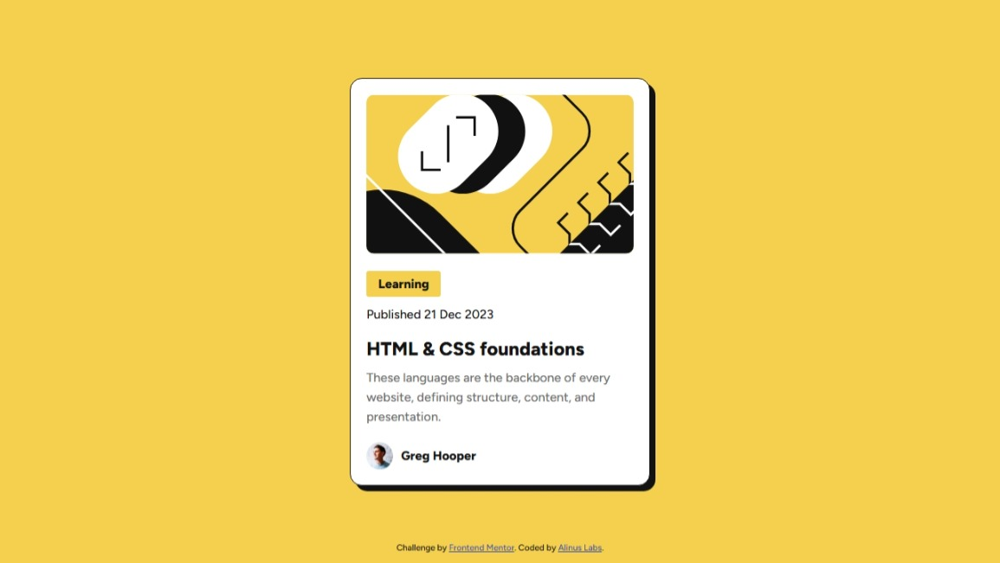

# Frontend Mentor - Blog preview card solution

This is a solution to the [Blog preview card challenge on Frontend Mentor](https://www.frontendmentor.io/challenges/blog-preview-card-ckPaj01IcS). Frontend Mentor challenges help you improve your coding skills by building realistic projects. 

## Table of contents

- [Overview](#overview)
  - [The challenge](#the-challenge)
  - [Screenshot](#screenshot)
  - [Links](#links)
- [My process](#my-process)
  - [Built with](#built-with)
  - [What I learned](#what-i-learned)
  - [Continued development](#continued-development)
  - [Useful resources](#useful-resources)
  - [AI Collaboration](#ai-collaboration)
- [Author](#author)
- [Acknowledgments](#acknowledgments)

## Overview

### The challenge

Users should be able to:

- See hover and focus states for all interactive elements on the page

### Screenshot

### Links

- Solution URL: [Solution URL](https://www.frontendmentor.io/solutions/blog-preview-card-frontend-mentor-ybFmaPof44)
- Live Site URL: [Live site URL](https://blog-preview-card-iota-seven.vercel.app/)

## My process

### Built with

- Semantic HTML5 markup
- CSS custom properties
- Flexbox
- CSS Grid
- Mobile-first workflow

## Author

- Website - [Alinus Labs](https://qr-code-component-fm-challenge.vercel.app/)
- Frontend Mentor - [@alinuslabs](https://www.frontendmentor.io/profile/alinuslabs)
- Twitter - [@alinuslabs](https://x.com/alinuslabs)
